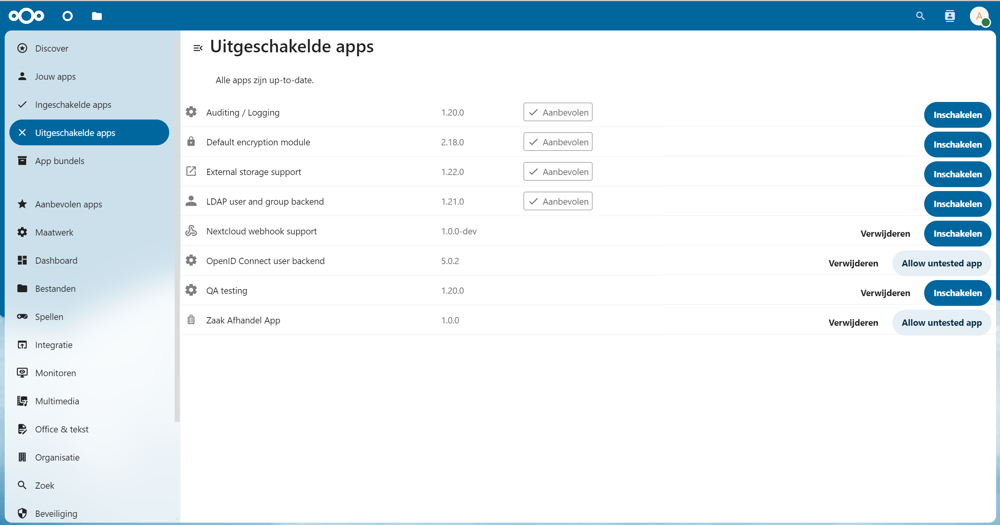
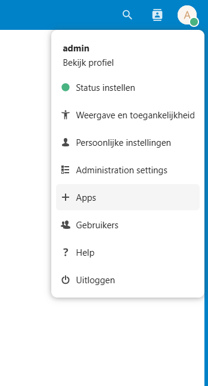
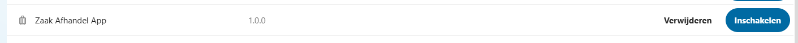
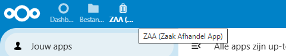

# Zaak Afhandel App

Deze nextcloud app voorziet in een klein doch volledige zaak afhandel applicatie

## Features

1. Zaakafhaneling
2. Toewijzen van taken aan medewerkers en klanten
3. Versturen van berichten
4. Inzien en aanpassen van klant gegevens

## Installatie

Volg voor het het lokaal installeren van Nextcloud de handleiding op https://cloud.nextcloud.com/s/iyNGp8ryWxc7Efa?dir=undefined&path=%2F1%20Setting%20up%20a%20development%20environment%2FTutorial%20for%20Windows&openfile=7087340

!let op! Installatie via de Nextcloud handleiding plaats de code in je ubuntu vm (wml) waarmee die niet vanzelf in windows file explorer terugkomt. Wil je je WSL bekijken via file explorer tik dan \\wsl$ in de adresbalk

1. Navigeer binnen de Nextcloud folder op je wsl naar de workspace/server/apps-extra map, als je de command line interface nog open hebt staan kan dat via cd workspace/server/apps-extra
2. Clone deze repository naar binnen via het commando `git clone https://github.com/ConductionNL/dsonextcloud`
3. Draai vervolgens de commando's `npm i` en daarna `npm run dev` via de command line interface.

   

# Frontend veranderen
Om de frontend te veranderen verander je de content in de .vue bestanden.
Elke keer als je iets hebt gewijzigd in en .vue bestand dan moet je `npm run dev` draaien. Een makkelijkere manier om dit bij te houden is `npm run watch` dit commando kijkt naar veranderingen in de .vue bestanden en zet dit meteen door.
Je moet wel elke keer als je iets veranderd verversen

## Code bekijken

\\wsl.localhost\Ubuntu-20.04\home\user\nextcloud-docker-dev\workspace\server\apps-extra

## Upen

`docker-compose up nextcloud proxy`

Clone de dsonextcloud app in de folder C:\path...\nextcloud-docker-dev\workspace\server\apps-extra en start de Nextcloud server op.
Open ondertussen een terminal in de dsonextcloud folder en run `npm i` en daarna `npm run dev`.
Als de server gestart is log dan in met het standaard admin account (name: admin, psw: admin).

Ga naar apps

en schakel de Zaak Afhandel App in.

Wacht totdat de app zichtbaar is in de navigatie balk en klik op de app.

## Documentatie
[Icons](https://pictogrammers.com/library/mdi/)

[Layout](https://docs.nextcloud.com/server/latest/developer_manual/design/layout.html)

[Componenten](https://nextcloud-vue-components.netlify.app/)
