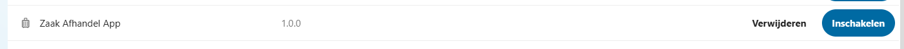
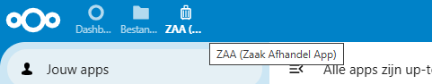
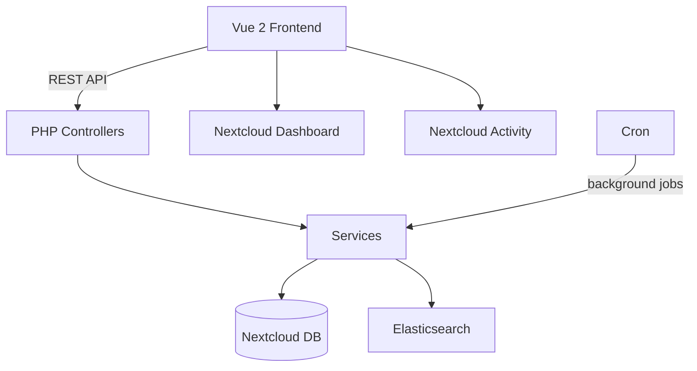

<p align="center">
  
</p>

<h1 align="center">Zaak Afhandel App</h1>

<p align="center">
  <strong>Case management for Nextcloud — ZGW-aligned case handling, task assignment, messaging, and customer interaction tracking</strong>
</p>

<p align="center">
  <a href="https://github.com/ConductionNL/zaakafhandelapp/releases"></a>
  <a href="https://github.com/ConductionNL/zaakafhandelapp/blob/main/LICENSE"></a>
  <a href="https://github.com/ConductionNL/zaakafhandelapp/actions"></a>
</p>

---

Zaak Afhandel App (ZAA) brings structured case handling (*zaakafhandeling*) into Nextcloud using Dutch government ZGW (Zaakgericht Werken) terminology and patterns. Case workers manage incoming cases from intake through resolution: assign tasks, exchange messages, log customer interactions, record decisions, and track every status transition — all within Nextcloud.

## Screenshots

<table>
  <tr>
    <td></td>
    <td></td>
  </tr>
  <tr>
    <td align="center"><em>Main View</em></td>
    <td align="center"><em>Navigation</em></td>
  </tr>
</table>

## Features

### Case (Zaak) Management
- **Case Lifecycle** — Full CRUD with status transitions from intake through formal closure
- **Case Types** — Define case type templates (*zaaktypen*) with workflow configurations and default properties
- **Case Properties** — Custom metadata fields (*eigenschappen*) per case type
- **Roles (Rollen)** — Assign parties to a case with typed roles (handler, advisor, requestor, etc.)
- **Decisions (Besluiten)** — Record formal decisions with description, type, and effective date
- **Results (Resultaten)** — Track and manage case outcomes

### Tasks & Messaging
- **Task Assignment** — Create tasks and assign them to staff members (*medewerkers*) or customers (*klanten*)
- **Task Lifecycle** — Track tasks through open → in progress → completed
- **Messaging** — Send and receive messages within a case context
- **Message Audit Trail** — Full history of message edits with revert capability

### Customer & Staff Management
- **Customer Profiles** — Manage citizen and organization data (*klanten*) with contact details and case history
- **Customer Audit Trail** — Full history of changes to customer records
- **Staff Profiles** — Manage employee accounts with department and role assignments
- **Staff Audit Trail** — Track staff profile changes

### Contact Moments
- **Contactmomenten** — Log every customer interaction: calls, emails, visits, and appointments
- **Interaction History** — View the complete communication timeline per case or customer
- **Detail Management** — Record participants, duration, notes, and outcomes per interaction

### Work Management
- **Dashboard** — Personal work queue (*werkvoorraad*) with case overview and quick-start panel
- **Dashboard Widgets** — Multiple widget types: Taken, Zaken, OpenZaken, ContactMomenten, Organisaties, Personen
- **Search** — Search across cases, customers, and tasks with faceted filtering

### Documents
- **Document Management** — Attach, organize, and manage case-related documents
- **Document Lifecycle** — Full CRUD with type classification and version tracking

## Architecture


```mermaid
graph TD
    A[Vue 2 Frontend] -->|REST API| B[PHP Controllers]
    B --> C[Services]
    C --> D[(Nextcloud DB)]
    C --> E[Elasticsearch]
    A --> F[Nextcloud Dashboard]
    A --> G[Nextcloud Activity]
    H[Cron] -->|background jobs| C
```

### Data Model

| Entity | Dutch Term | Description |
|--------|-----------|-------------|
| Case | Zaak | Central case record with type, status, and all associated data |
| Task | Taak | Work item assigned to a staff member or customer |
| Customer | Klant | Citizen or organization involved in a case |
| Staff | Medewerker | Employee handling or advising on cases |
| Role | Rol | Typed relationship between a party and a case |
| Contact Moment | Contactmoment | Logged customer interaction |
| Message | Bericht | Message exchanged within a case |
| Decision | Besluit | Formal case decision |
| Document | Document | File attached to a case |
| Result | Resultaat | Case outcome |
| Case Type | ZaakType | Template defining workflow and properties for a class of cases |

**Data standard:** ZGW (Zaakgericht Werken) — VNG-Realisatie GEMMA architecture.

### Directory Structure

```
zaakafhandelapp/
├── appinfo/           # Nextcloud app manifest, routes, navigation
├── lib/               # PHP backend — controllers, services, event listeners, widgets
│   ├── Controller/    # API controllers for all entities
│   ├── Service/       # Business logic per entity type
│   ├── Dashboard/     # Nextcloud Dashboard widget definitions
│   └── EventListener/ # Case lifecycle event handling
├── src/               # Vue 2 frontend — components, Pinia stores, views
│   ├── views/         # Zaken, Taken, Klanten, Medewerkers, Contactmomenten, Dashboard
│   ├── modals/        # CRUD modals per entity type
│   ├── store/         # Pinia stores per entity
│   └── entities/      # Zod-validated entity classes
├── docs/              # Documentation and app review
├── img/               # App icons and screenshots
└── l10n/              # Translations (nl, en)
```

## Requirements

| Dependency | Version |
|-----------|---------|
| Nextcloud | 28 – 33 |
| PHP | 8.1+ |
| Database | PostgreSQL 10+, MySQL 8.0+, SQLite |
| Elasticsearch | optional — for full-text case search |

## Installation

### From the Nextcloud App Store

1. Go to **Apps** in your Nextcloud instance
2. Search for **Zaak Afhandel App**
3. Click **Download and enable**

### From Source

```bash
cd /var/www/html/custom_apps
git clone https://github.com/ConductionNL/zaakafhandelapp.git
cd zaakafhandelapp
npm install
npm run build
composer install
php occ app:enable zaakafhandelapp
```

## Development

### Start the environment

```bash
docker compose -f openregister/docker-compose.yml up -d
```

### Frontend development

```bash
cd zaakafhandelapp
npm install
npm run dev        # Watch mode
npm run build      # Production build
```

### Code quality

```bash
# PHP
composer phpcs          # Check coding standards
composer cs:fix         # Auto-fix issues
composer phpmd          # Mess detection
composer phpmetrics     # HTML metrics report

# Frontend
npm run lint            # ESLint
npm run stylelint       # CSS linting
```

## Tech Stack

| Layer | Technology |
|-------|-----------|
| Frontend | Vue 2.7, Pinia, @nextcloud/vue, Bootstrap Vue |
| Validation | Zod (runtime schema validation) |
| Build | Webpack 5, @nextcloud/webpack-vue-config |
| Backend | PHP 8.1+, Nextcloud App Framework |
| Search | SQL ILIKE (default) + Elasticsearch (optional) |
| Quality | PHPCS, PHPMD, phpmetrics, ESLint, Stylelint |

## Standards & Compliance

- **ZGW (Zaakgericht Werken):** VNG-Realisatie GEMMA case management standard
- **GEMMA API:** Aligned with Dutch government common architecture patterns
- **Accessibility:** WCAG AA (Dutch government requirement)
- **Audit trail:** Full change history on all case objects
- **Localization:** Dutch (primary) and English

## Related Apps

- **[Procest](https://github.com/ConductionNL/procest)** — More advanced case management with CMMN 1.1, ZGW mapping, and Pipelinq integration
- **[Pipelinq](https://github.com/ConductionNL/pipelinq)** — CRM intake; hands off requests as new cases
- **[OpenRegister](https://github.com/ConductionNL/openregister)** — Object storage layer

## API Reference

ZGW API standard documentation: [vng-realisatie.github.io/gemma-zaken](https://vng-realisatie.github.io/gemma-zaken/)

## License

EUPL-1.2

## Authors

Built by [Conduction](https://conduction.nl) — open-source software for Dutch government and public sector organizations.
