# Zaak Afhandel App — Comprehensive Page Review

**App version:** 0.1.29
**Reviewed:** 2026-02-26
**Environment:** Nextcloud on localhost:8080, admin:admin

## Overview

The Zaak Afhandel App (ZAA) is a Dutch-language case management application for Nextcloud. It serves as the precursor to the Procest app. The app follows a consistent three-panel Nextcloud layout: **left sidebar navigation**, **main content area**, and optional **right sidebar** (on some pages).

All entity pages currently show **empty states** (no data configured). The app uses ZGW (Zaakgericht Werken) terminology throughout.

---

## Global Navigation

The left sidebar is consistent across all pages and contains:

| Element | Type | Description |
|---------|------|-------------|
| **Zaak Starten** | Primary button (top) | Opens the Zaak creation modal |
| Dashboard | Nav link | `/apps/zaakafhandelapp/` |
| Zaken | Nav link | `/apps/zaakafhandelapp/zaken` |
| Taken | Nav link | `/apps/zaakafhandelapp/taken` |
| Klanten | Nav link | `/apps/zaakafhandelapp/klanten` |
| Medewerkers | Nav link | `/apps/zaakafhandelapp/medewerkers` |
| Contact momenten | Nav link | `/apps/zaakafhandelapp/contactmomenten` |
| Berichten | Nav link | `/apps/zaakafhandelapp/berichten` |
| Rollen | Nav link | `/apps/zaakafhandelapp/rollen` |
| Zoeken | Nav link | `/apps/zaakafhandelapp/zoeken` |
| **Instellingen** | Expandable button (bottom) | Reveals: Zaak Typen, Audit trail, Configuration |

---

## 1. Dashboard

**URL:** `/apps/zaakafhandelapp/`

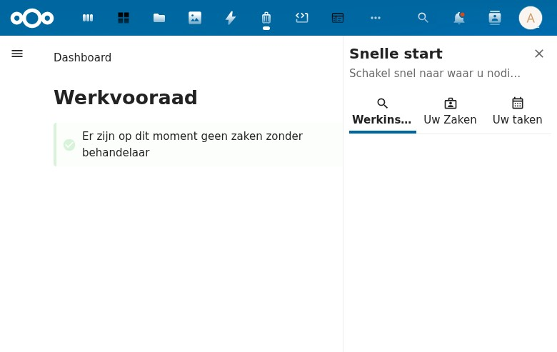

### Layout
- **Main area:** Shows "Dashboard" heading, "Werkvooraad" (Work queue) section
- **Right sidebar:** "Snelle start" (Quick start) panel with tabs

### Main Content
- **Heading:** "Dashboard" (h1) + "Werkvooraad" (h2)
- **Info notice:** Green checkmark icon with message: *"Er zijn op dit moment geen zaken zonder behandelaar"* (There are currently no cases without a handler)
- No KPIs, charts, or statistics visible — just the work queue message

### Right Sidebar — "Snelle start"
- **Title:** "Snelle start" (Quick start)
- **Subtitle:** "Schakel snel naar waar u nodig bent" (Switch quickly to where you need to be)
- **Close button** (X) to dismiss sidebar
- **Three tabs:**
  1. **Werkinstructies** (Work instructions) — Selected by default, shows heading only, no content
  2. **Uw Zaken** (Your Cases) — Empty
  3. **Uw taken** (Your tasks) — Empty

### Observations
- Dashboard is minimal — only shows unassigned cases queue
- No KPI cards, no status charts, no activity feed
- The "Snelle start" sidebar is a useful concept but has no content when empty
- The "Werkvooraad" concept (work queue for unassigned cases) is a good UX pattern

---

## 2. Zaken (Cases)

**URL:** `/apps/zaakafhandelapp/zaken`

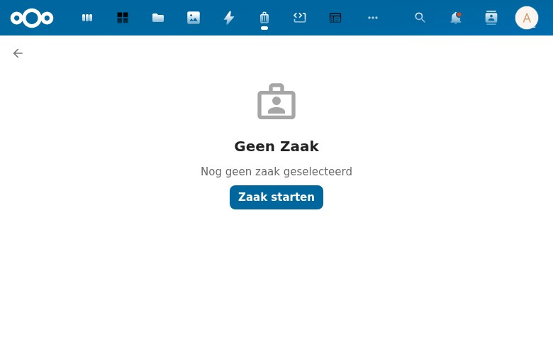

### Layout
- **Back button** (arrow) in top-left
- **Empty state** centered in main content area
- No right sidebar

### Empty State
- **Icon:** Person/case icon (gray)
- **Title:** "Geen Zaak" (No Case)
- **Description:** "Nog geen zaak geselecteerd" (No case selected yet)
- **CTA button:** "Zaak starten" (Start case) — primary blue button

### Observations
- Uses a list/detail split layout pattern — the left panel (hidden when no items) would show a list, the right panel shows the detail
- The empty state text says "no case selected" rather than "no cases exist", suggesting this is a selection prompt
- "Zaak starten" button opens the create modal (same as sidebar button)

---

## 3. Taken (Tasks)

**URL:** `/apps/zaakafhandelapp/taken`

### Layout
- Identical layout pattern to Zaken
- Back button, empty state, no right sidebar

### Empty State
- **Icon:** Calendar/grid icon (gray)
- **Title:** "Geen taak" (No task)
- **Description:** "Nog geen taak geselecteerd" (No task selected yet)
- **CTA button:** "Taak toevoegen" (Add task)

### Observations
- Different icon from Zaken page (calendar vs person)
- Same list/detail pattern
- "Toevoegen" (add) vs "starten" (start) — different verbs used for different entity types

---

## 4. Klanten (Customers)

**URL:** `/apps/zaakafhandelapp/klanten`

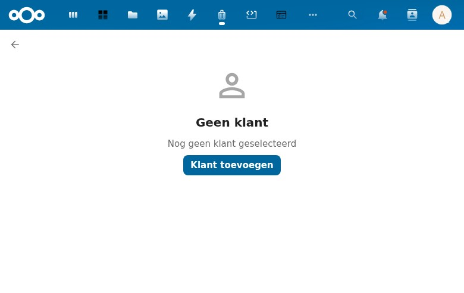

### Empty State
- **Icon:** Person outline icon (gray)
- **Title:** "Geen klant" (No customer)
- **Description:** "Nog geen klant geselecteerd" (No customer selected yet)
- **CTA button:** "Klant toevoegen" (Add customer)

### Observations
- Same layout pattern as all entity pages
- Represents the citizen/customer in the case management context

---

## 5. Medewerkers (Employees)

**URL:** `/apps/zaakafhandelapp/medewerkers`

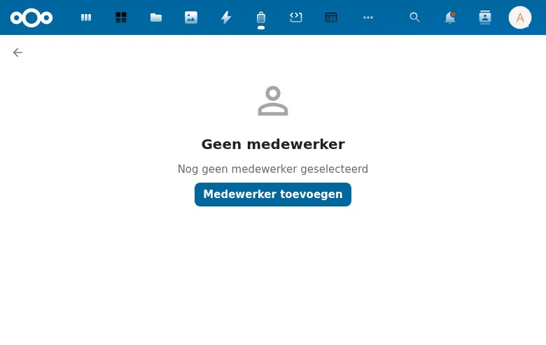

### Empty State
- **Icon:** Person outline icon (slightly different from Klanten — no border on head)
- **Title:** "Geen medewerker" (No employee)
- **Description:** "Nog geen medewerker geselecteerd" (No employee selected yet)
- **CTA button:** "Medewerker toevoegen" (Add employee)

### Observations
- Separate entity from Nextcloud users — represents employees in the organizational context
- Same pattern, different icon to distinguish from Klanten

---

## 6. Contact momenten (Contact Moments)

**URL:** `/apps/zaakafhandelapp/contactmomenten`

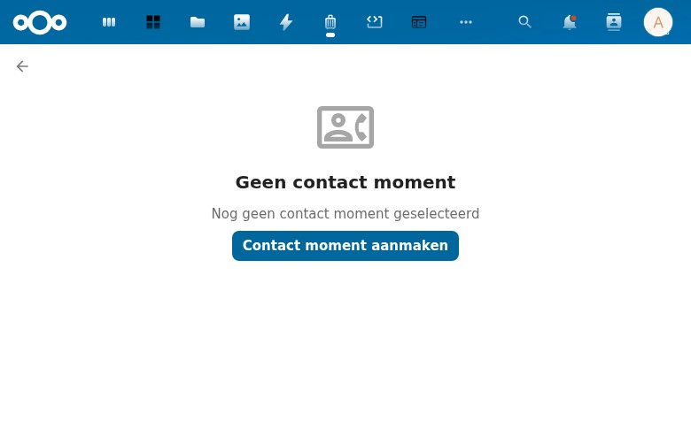

### Empty State
- **Icon:** Person with badge/card icon (gray, more detailed)
- **Title:** "Geen contact moment" (No contact moment)
- **Description:** "Nog geen contact moment geselecteerd" (No contact moment selected yet)
- **CTA button:** "Contact moment aanmaken" (Create contact moment)

### Observations
- ZGW concept: records of interactions with citizens
- Button uses "aanmaken" (create) rather than "toevoegen" (add)
- Different verbs for different entities: starten (cases), toevoegen (tasks/customers/employees), aanmaken (contact moments/messages)

---

## 7. Berichten (Messages)

**URL:** `/apps/zaakafhandelapp/berichten`

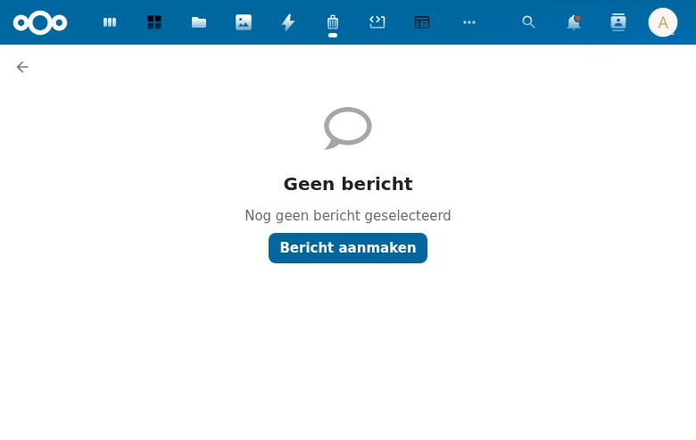

### Empty State
- **Icon:** Speech bubble icon (gray)
- **Title:** "Geen bericht" (No message)
- **Description:** "Nog geen bericht geselecteerd" (No message selected yet)
- **CTA button:** "Bericht aanmaken" (Create message)

### Observations
- Communication/messaging functionality
- Uses "aanmaken" verb like Contact momenten

---

## 8. Rollen (Roles)

**URL:** `/apps/zaakafhandelapp/rollen`

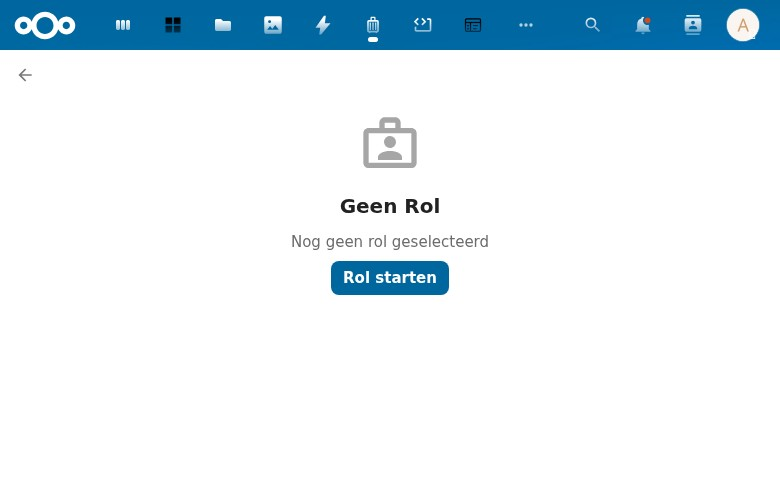

### Empty State
- **Icon:** Person with briefcase icon (gray)
- **Title:** "Geen Rol" (No Role)
- **Description:** "Nog geen rol geselecteerd" (No role selected yet)
- **CTA button:** "Rol starten" (Start role)

### Observations
- ZGW concept: roles define the relationship between a person and a case
- Uses "starten" verb like Zaken, suggesting a role is something you initiate
- Capitalization inconsistency: "Geen Rol" vs "Geen taak" — mixed casing

---

## 9. Zoeken (Search)

**URL:** `/apps/zaakafhandelapp/zoeken`

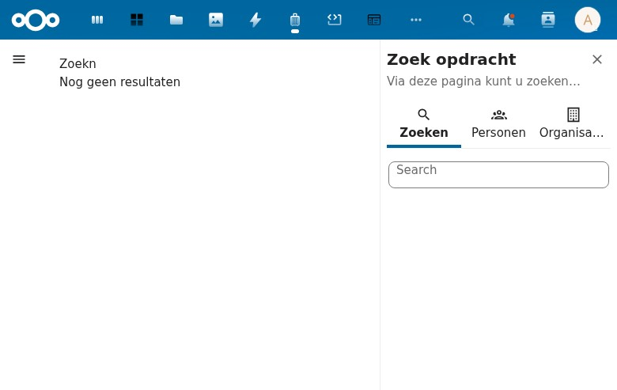

### Layout
- **Main area:** Search results (currently empty)
- **Right sidebar:** "Zoek opdracht" (Search query) panel with tabs
- **Hamburger menu** visible in top-left (sidebar collapsed)

### Main Content
- **Heading:** "Zoekn" (h1) — **TYPO**: should be "Zoeken"
- **Message:** "Nog geen resultaten" (No results yet)

### Right Sidebar — "Zoek opdracht"
- **Title:** "Zoek opdracht" (Search query)
- **Subtitle:** "Via deze pagina kunt u zoeken binnen uw gemeente" (Via this page you can search within your municipality)
- **Three tabs:**
  1. **Zoeken** (Search) — Selected by default, contains a text search field
  2. **Personen** (Persons) — For person-specific search
  3. **Organisaties** (Organizations) — For organization-specific search

### Console Errors
- `Failed to load resource: /api/klanten` — API returns HTML instead of JSON (500 error)

### Observations
- **Bug:** Typo in heading "Zoekn" should be "Zoeken"
- **Bug:** API errors when loading the search page (klanten endpoint returns 500)
- The search sidebar with tabs for different entity types is a good UX pattern
- Municipality-oriented ("gemeente") — confirms this is for Dutch government use

---

## 10. Instellingen — Zaak Typen (Settings — Case Types)

**URL:** `/apps/zaakafhandelapp/zaaktypen`

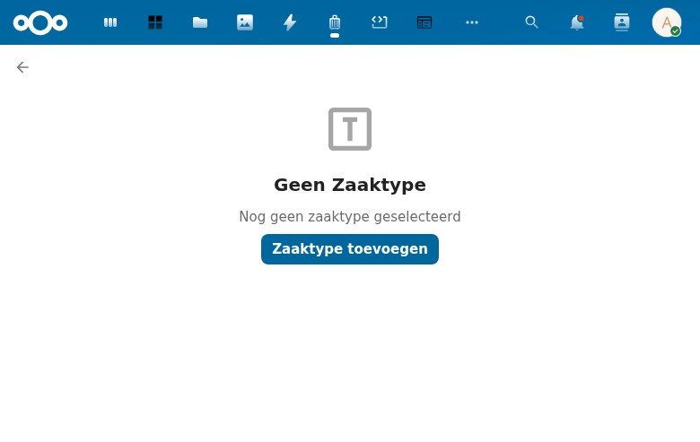

### Layout
- Back button in top-left
- Full-page empty state (no sidebar navigation visible)
- Multiple console errors (CSS/JS resource loading failures)

### Empty State
- **Icon:** Letter "T" in a box (gray)
- **Title:** "Geen Zaaktype" (No Case Type)
- **Description:** "Nog geen zaaktype geselecteerd" (No case type selected yet)
- **CTA button:** "Zaaktype toevoegen" (Add case type)

### Console Errors
- Refused to apply styles and execute scripts — likely CSP (Content Security Policy) issues
- `TypeError: Failed to fetch` — API connectivity problems

### Observations
- Case types are the foundation of the ZGW model — cases must have a type
- The page loads but with significant resource errors
- Without case types, the "Zaak Starten" functionality cannot work properly

---

## 11. Instellingen — Audit Trail

**URL:** `/apps/zaakafhandelapp/auditTrail`
**Status:** 404 — Page not found

### Observations
- The sidebar navigation has a link to this page, but the route is not registered in the backend
- The URL uses camelCase (`auditTrail`) which may be a routing configuration issue
- **Bug:** Dead link in navigation — leads to Nextcloud's 404 page

---

## 12. Instellingen — Configuration

**URL:** Not determined (sidebar link uses `#`)
**Status:** Navigation item present but link is `#` (no-op)

### Observations
- The Configuration link in the sidebar doesn't navigate anywhere
- It appears to be a placeholder or unimplemented feature

---

## Modals

### Zaak Aanmaken (Create Case)

**Trigger:** "Zaak starten" button (sidebar or Zaken page)

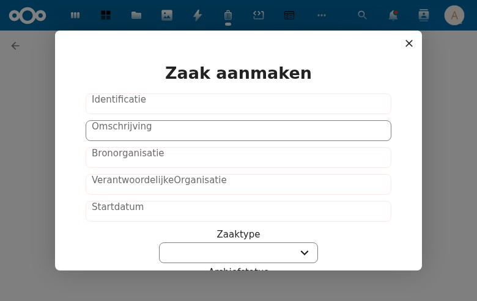

### Fields
| Field | Type | Required | Notes |
|-------|------|----------|-------|
| Identificatie | Text input | ? | Case identifier |
| Omschrijving | Text input | ? | Description |
| Bronorganisatie | Text input | ? | Source organization |
| VerantwoordelijkeOrganisatie | Text input | ? | Responsible organization |
| Startdatum | Text input | ? | Start date (plain text, no date picker) |
| Zaaktype | Combobox/dropdown | ? | Case type selection — loads from API (fails with 500) |
| Archiefstatus | Combobox/dropdown | ? | Archive status |
| Uiterlijke Einddatum Afdoening | Date picker | ? | Ultimate completion deadline |
| Registratiedatum | Text input | ? | Registration date |
| Toelichting | Text input | ? | Explanation/notes |

### Buttons
- **Aanmaken** (Create) — Disabled (grayed out), presumably needs required fields

### Observations
- ZGW-compliant field names (Dutch government standard)
- "Startdatum" is a plain text field instead of a date picker — inconsistent with "Uiterlijke Einddatum Afdoening" which does have a date picker
- "VerantwoordelijkeOrganisatie" is displayed without spaces — poor label formatting
- The "Aanmaken" button is disabled, likely because Zaaktype dropdown fails to load options (API 500 error)
- No visible validation messages or required field indicators
- No "Annuleer" (Cancel) button — only the X close button

---

### Taak (Create Task)

**Trigger:** "Taak toevoegen" button (Taken page)

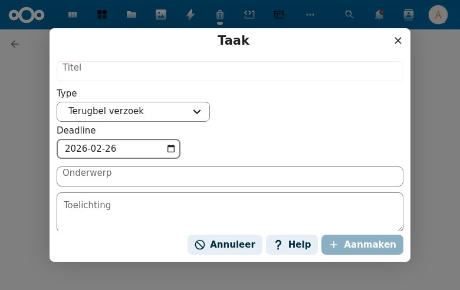

### Fields
| Field | Type | Default | Notes |
|-------|------|---------|-------|
| Titel | Text input | — | Task title |
| Type | Combobox/dropdown | "Terugbel verzoek" | Task type (callback request) |
| Deadline | Date picker | Current date (2026-02-26) | With calendar icon |
| Onderwerp | Text input | — | Subject |
| Toelichting | Textarea | — | Explanation/notes (multiline) |
| Klant / Medewerker | Checkbox toggle | Unchecked | Toggles Klant dropdown |
| Klant* | Combobox/dropdown | — | Customer selection (shown when checkbox is checked) |

### Buttons
- **Annuleer** (Cancel) — with prohibition icon
- **Help** — with question mark icon
- **Aanmaken** (Create) — Disabled, with plus icon

### Observations
- Better UX than the Zaak modal — has Cancel and Help buttons
- Default task type "Terugbel verzoek" (callback request) suggests common use case
- Deadline auto-fills with today's date — good default
- The Klant/Medewerker checkbox toggle is a nice conditional field pattern
- API errors when loading: klanten and contactmomenten endpoints return 500
- "Klant*" with asterisk suggests required when visible, but no other fields show required indicators

---

## Cross-Cutting Observations

### UI Patterns
1. **Consistent empty states**: Every entity page uses the same pattern: icon + "Geen [entity]" + description + CTA button
2. **Three-panel layout**: Sidebar nav (left), main content (center), optional detail sidebar (right)
3. **Nextcloud Vue components**: Uses standard NcButton, NcAppNavigation, NcModal components
4. **Dutch-only**: No internationalization visible — all strings are hardcoded in Dutch

### Bugs Found
| # | Severity | Page | Issue |
|---|----------|------|-------|
| 1 | Medium | Zoeken | Typo: "Zoekn" should be "Zoeken" |
| 2 | High | Multiple | API endpoints return 500 errors (klanten, zaaktypen, contactmomenten) |
| 3 | Medium | Audit Trail | 404 — route not registered but linked in navigation |
| 4 | Low | Configuration | Dead link (`#`) in navigation |
| 5 | Medium | Zaak modal | Startdatum is plain text instead of date picker |
| 6 | Low | Zaak modal | "VerantwoordelijkeOrganisatie" label has no spaces |
| 7 | Low | Various | Inconsistent capitalization: "Geen Rol" vs "Geen taak" |
| 8 | Low | Various | Inconsistent button verbs: starten/toevoegen/aanmaken |

### Architecture Notes
- **ZGW-aligned**: Uses standard Dutch government case management terminology (Zaak, Zaaktype, Rol, Contactmoment)
- **API layer**: Appears to proxy to external ZGW APIs (`/api/ztc/zaaktypen`, `/api/klanten`)
- **Vue 2 + Nextcloud Vue**: Standard Nextcloud frontend stack
- **Entity types**: 8 main entities (Zaken, Taken, Klanten, Medewerkers, Contact momenten, Berichten, Rollen, Zaak Typen)
- **Search**: Separate search page with tabbed search by entity type (Personen, Organisaties)

### Feature Comparison with Procest

| Feature | ZAA (this app) | Procest |
|---------|---------------|---------|
| Dashboard | Minimal (work queue only) | KPIs, status chart, overdue panel, activity feed, my work |
| Case creation | Modal with ZGW fields | Modal with configurable case types |
| Tasks | Basic modal (type, deadline) | BPMN lifecycle (available/active/completed) |
| Navigation | 10 entity pages | Simplified (Dashboard, Cases, Tasks, Settings) |
| Search | Dedicated page with tabs | Integrated list filtering |
| Settings | Zaak Typen + broken pages | Case types, status types configuration |
| API model | ZGW proxy (external APIs) | OpenRegister (internal storage) |
| Language | Dutch only | Internationalized (t() function) |
| Status tracking | Not visible | Status timeline, quick status dropdown |
| Overdue handling | Not visible | Deadline panel, overdue indicators |
