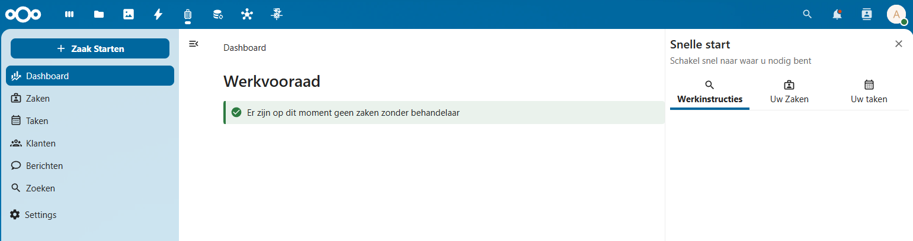

# Dashboard

## Werkvoorraad

Hier wordt weergegeven of er openstaande zaken zijn zonder toegewezen behandelaar.

## Snelle Start

Rechts in het Dashboard is de **Snelle start**-sectie te vinden,&#x20;

die snelkoppelingen biedt naar de volgende functies:

* **Werkinstructies**: Informatie en handleidingen voor specifieke workflows.
* **Uw Zaken**: Directe toegang tot de lijst van toegewezen zaken.
* **Uw Taken**: Overzicht van toegewezen taken.

<figure><figcaption></figcaption></figure>
